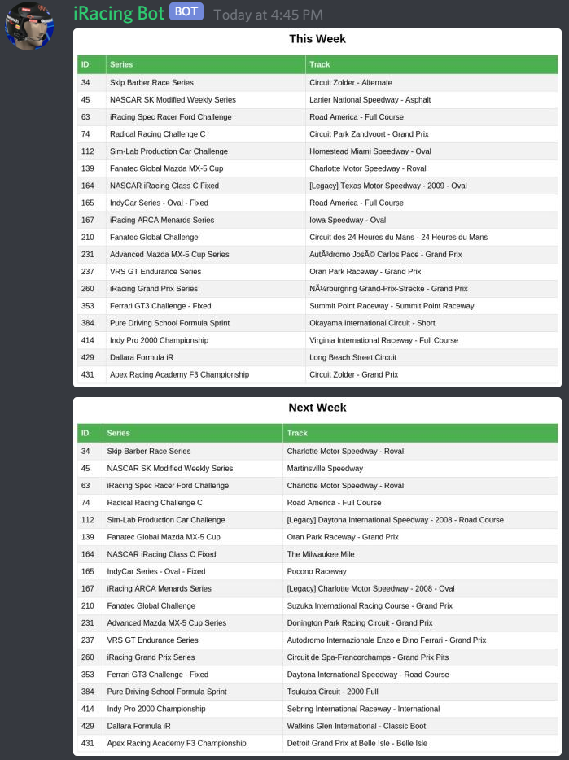
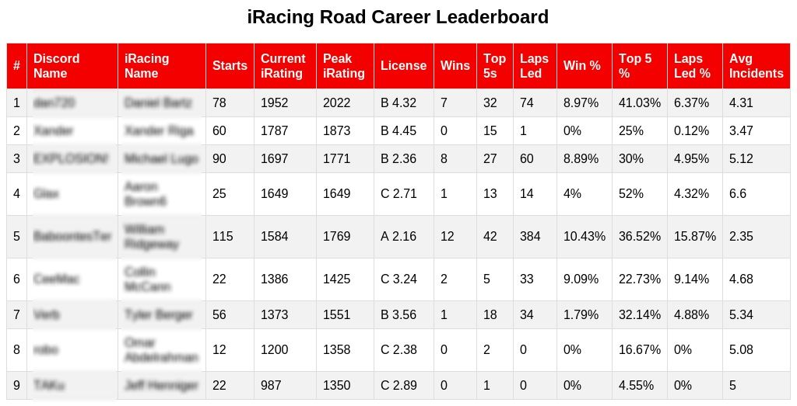
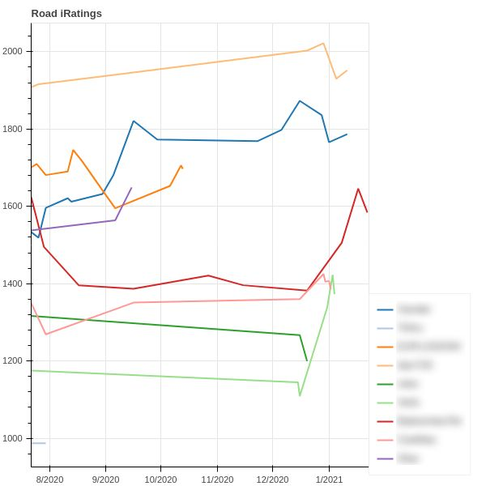
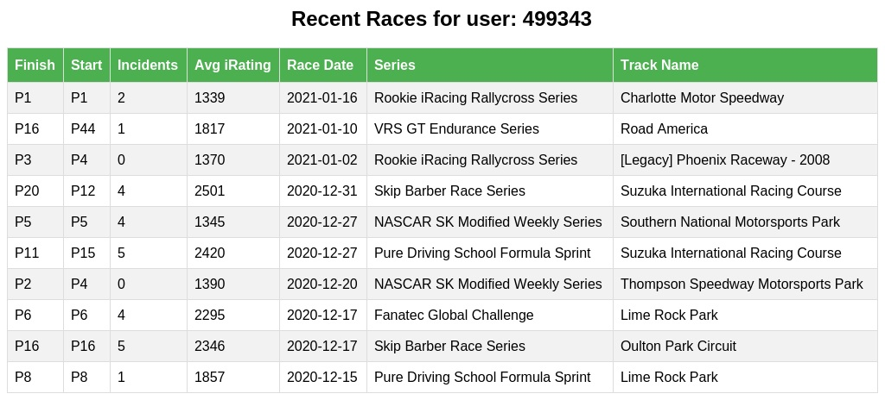

# iRacing Cog
This is a cog for discord.py that allows users to view and compare their iRacing data directly inside of discord.

This uses [pyracing](https://github.com/Esterni/pyracing) under the hood, which I also contribute to.

## You can always use `!help` to see what the bot can do

# What it Does
This bot has 2 primary functions, it can show you the current weekly combos of what track your favorite series are on, 
and compare you to your friends through the leaderboards and other statistics. 
You can find examples of these actions and the commands to do these actions below.

# Some Important Notes
- The iRacing API is _slow_ to update. 
  When you finish a race it can take a day or sometimes more to appear in their API, which means the bot will not have that information either.
  When in doubt, run `!update`
- Please do not spam `!update` and `!updateserver`. 99% of the time the iRacing API just hasn't updated yet, 
  so you will never get live to the minute data, that just isn't a capability of the current iRacing API.

# Bot Invite Link
Want the bot in your discord? Click this link to add it:
https://discord.com/oauth2/authorize?client_id=706222703664693308&scope=bot

# Support & Questions
Come to the discord [here](https://discord.gg/bAq8Ec5JPQ) for support

# Examples

## Commands
## Series Combos Related
### !allseries
This will give a list of all current active series names and IDs(which are used for the favorite series commands).

### !setfavseries <Series IDs\> OR !addfavseries <Series IDs\>
This will set the favorite series for your discord server. Series IDs in this case is a list of comma separated
Series IDs that can be found from the `!allseries` command. Setting favorite series is necessary to
use the `!currentseries` command.

### !currentseries
Once favorite series have been set through `!setfavseries` this command prints images
showing the current tracks for each of the favorite series for this discord server 
for this race week and the next race week.

### !removefavseries
This removes a single favorite from the saved favorite series for the discord server you are in.

## Leaderboard/Statistics Related
### !saveid <iRacing Client ID\>
Use this command to save your iRacing ID to your discord ID.
If you already have one saved this will overwrite it

### !savename <iRacing Name\>
Use this command to save your name and iRacing ID to your discord ID.
The name you submit must be exactly the same as your name on iRacing, including any numbers
If you already have one saved this will overwrite it

### !recentraces <iRacing Client ID \>
This gives detailed information on the last 10 races of the given user.
If no iRacing Client ID is provided, it will default to the saved ID of the user who called it.
If the user who called it has not saved their ID, then they must provide an ID when calling.

### !update
This will update the saved information for just the user who called the command.

### !updateserver
This will update the saved information for all users in the discord for use of the `!leaderboard` command.
All discords are automatically updated every hour, so often this is unnecessary to run.

**NOTE:** The iRacing API does not update frequently, so even if you finished a race recently and expect to see changes, 
it can take up to a day for those to come through on the bot.

### !leaderboard <category\> <type\>
This prints a leaderboard of all users with saved IDs(through the `!saveid` command) for the given category and type.
Category can be any of `road`, `oval`, `dirtroad`, and `dirtoval`, but it defaults to `road`.
Type is either `career` or `yearly`, and it defaults to career. `career` will show all time data, 
and `yearly` will only show data from the current year.

**NOTE:** This can be called with a category and no type, but if you want to call with a type, you need to pass a category.
For instance, I can call `!leaderboard oval`, but if I want the road leaderboard yearly I need to specify: `!leaderboard road yearly`, `!leaderboard yearly` is **NOT** valid.

### !careerstats <iRacing Client ID\>
This will give an overview of the career stats of the player with the given iRacing Client ID.
If an iRacing Client ID is not provided, then it will use the saved ID for the user who called the command.
If the user has not saved their ID, they must provide an iRacing Client ID.

### !yearlystats <iRacing Client ID\>
This will give an overview of the yearly stats of the player with the given iRacing Client ID.
If an iRacing Client ID is not provided, then it will use the saved ID for the user who called the command.
If the user has not saved their ID, they must provide an iRacing Client ID.

# Local Setup
Want to run your own instance of this bot? Check out the instructions [here](https://github.com/XanderRiga/iracing_bot#local-setup) 
to get started. You will need this repo and the iracing bot repo for it all to work.
